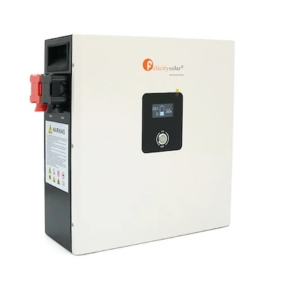
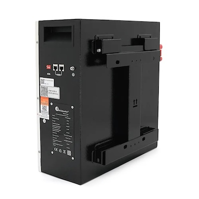
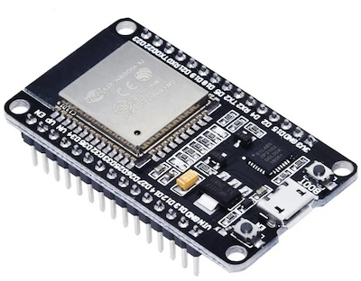
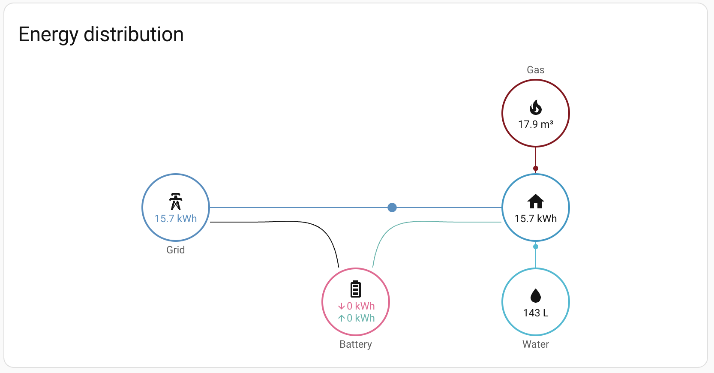
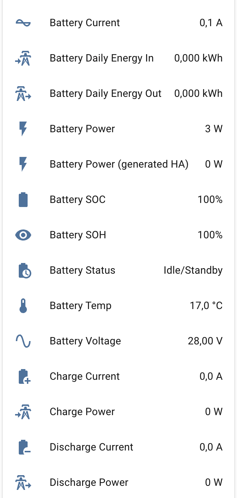
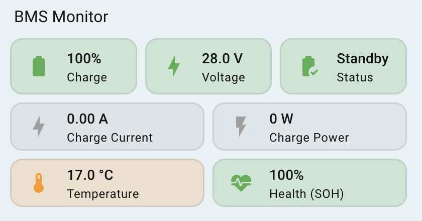
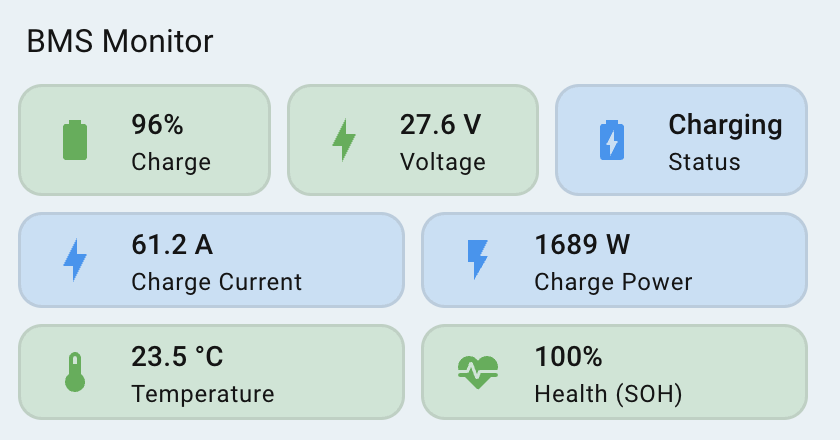

# Felicity Solar BMS to Home Assistant (CAN Bus)

## 📖 Project Background
> [!NOTE]
> *As it often happens, I had a bit of bad luck with my inverter — it doesn't integrate with Home Assistant, and so far, I haven't managed to get it talking to the FelicityESS LiFePO4 BMS (I didn't dive too deep into why, but it is what it is). I also got tired of constantly running to the garage just to check the battery charge.*  
> *I wanted to see everything in Home Assistant, complete with beautiful icons, various automations, and all the other perks that a Smart Home provides.*  
> *A lot of time was spent solving this task; I tried every battery interface (including RS485), and finally, I managed to find the working protocols, make the correct wiring, and extract the core battery data.*  
> *Unfortunately, it doesn't report individual cell voltages, real capacity, or cycle counts over the CAN bus, and it refused to give up any data over RS485 at all.*  

## ✨ Key Features
* 📡 **Real-time Monitoring** – Live data from BMS via CAN bus protocol.
* 🔋 **Precise SOC & Voltage Tracking** – Accurate battery state of charge and voltage levels.
* 🌡️ **Temperature & Health Monitoring** – Keep an eye on battery cell temp and SOH (State of Health).
* ⚡ **Energy Flow Analytics** – Separate tracking for Charge/Discharge current and power.
* 📊 **Energy Dashboard Ready** – Pre-configured sensors for Home Assistant Energy Dashboard (kWh).
* 🎨 **Mushroom UI Design** – Dynamic, color-coded dashboard card included.

## ✨ Project Overview  
This project enables the integration of Felicity Solar lithium battery BMS monitoring (tested on FelicityESS LiFePO4 LPBF24200-A) into the Home Assistant smart home system using the CAN protocol.  



## 🛠 Hardware
The following hardware was used for this project:

| Controller: ESP32-WROOM-32 DevKit V1 | CAN Transceiver: SN65HVD230 (3.3V) |
| :---: | :---: |
|  |  |

Use a "twisted pair" cable (RJ45) to connect to the BMS port on the battery.  

Battery COM port pinout:  
  

> [!WARNING]
> For connection with the CAN transceiver, use pins 1, 3, and 4 (DO NOT use 7 or 8 — you will not receive any data from them). For the remaining unused pins, either do not crimp them or insulate them after cutting to prevent them from shorting to each other.

### 🛠 Connection Details:
#### 1. Connection: Felicity Battery ↔ CAN Module (SN65HVD230)
| Battery Pin (RJ45) | Signal Name | CAN Module Pin |
| :--- | :--- | :--- |
| **1** | GND | **GND** |
| **3** | CANL-PCS | **L (CANL)** |
| **4** | CANH-PCS | **H (CANH)** |  

#### 2. Connection: CAN Module ↔ ESP32-WROOM-32
| CAN Module Pin | ESP32 Pin | Note |
| :--- | :--- | :--- |
| **3.3V** | 3V3 | Power |
| **GND** | GND | Common Ground |
| **RX** | GPIO 16 (RX2) | Data Reception |
| **TX** | GPIO 17 (TX2) | Data Transmission |  

## 🎨 ESPHome Configuration Code (YAML)

<details>
  <summary>▶ Click here to view the full configuration code</summary>  
  
```yaml  

# Main project settings
esphome:
  name: "bms-monitor"
  friendly_name: BMS Monitor Felicity
  min_version: 2025.11.0
  name_add_mac_suffix: false

# Microcontroller configuration
esp32:
  board: esp32dev
  framework:
    type: arduino

# Enable logging (diagnostics output)
logger:
  level: INFO

# Enable Home Assistant API
api:

# Allow Over-The-Air updates
ota:
- platform: esphome

# Web server for browser-based log monitoring
#web_server:
#  port: 80

# Wi-Fi configuration (credentials from secrets.yaml)
wifi:
  ssid: !secret wifi_ssid
  password: !secret wifi_password

# Synchronize time with Home Assistant
time:
  - platform: homeassistant
    id: homeassistant_time

# CAN Bus configuration for BMS communication
canbus:
  - platform: esp32_can
    id: bms_can
    can_id: 0x100
    tx_pin: GPIO17
    rx_pin: GPIO16
    bit_rate: 500kbps # Bus speed: 500 kbps
    mode: NORMAL
    on_frame:
      # Frame 0x351: State of Health (SOH) processing
      - can_id: 0x351
        then:
          - lambda: |-
              // Read bytes 4 & 5, multiply by 0.1 to get percentage
              float val = (uint16_t)(x[5] << 8 | x[4]) * 0.1;
              if (val <= 100) id(battery_soh).publish_state(val);

      # Frame 0x355: State of Charge (SOC) processing
      - can_id: 0x355
        then:
          - lambda: |-
              // Read bytes 0 & 1 for charge percentage
              float val = (uint16_t)(x[1] << 8 | x[0]);
              if (val <= 100) id(battery_soc).publish_state(round(val));

      # Frame 0x356: Voltage, Current, Temperature, and Power Flow
      - can_id: 0x356
        then:
          - lambda: |-
              // Decoding data from the frame
              float v = (uint16_t)(x[1] << 8 | x[0]) * 0.01; // Voltage (V)
              float c = (int16_t)(x[3] << 8 | x[2]) * 0.1;   // Current (A)
              float t = (int16_t)(x[5] << 8 | x[4]) * 0.1;   // Temperature (°C)
              float p = v * c;                               // Power calculation (P = U * I)

              // Publish base values
              id(battery_voltage).publish_state(v);
              id(battery_current).publish_state(c);
              id(battery_temp).publish_state(t);
              id(battery_power).publish_state(p);

              // Split logic for Charge/Discharge with a 1.8A deadband
              // Helps prevent status "flickering" due to minor current fluctuations
              if (c > 1.8) {
                // Status: Charging
                id(charge_current).publish_state(c);
                id(discharge_current).publish_state(0);
                id(charge_power).publish_state(p);
                id(discharge_power).publish_state(0);
                id(battery_status).publish_state("Charging");
              } else if (c < -1.8) {
                // Status: Discharging (using fabs for positive values in sensors)
                id(charge_current).publish_state(0);
                id(discharge_current).publish_state(fabs(c));
                id(charge_power).publish_state(0);
                id(discharge_power).publish_state(fabs(p));
                id(battery_status).publish_state("Discharging");
              } else {
                // Status: Idle/Standby or very low load
                id(charge_current).publish_state(0);
                id(discharge_current).publish_state(0);
                id(charge_power).publish_state(0);
                id(discharge_power).publish_state(0);
                id(battery_status).publish_state("Idle/Standby");
              }

# Virtual sensors for Home Assistant
sensor:
  # Primary electrical measurements
  - platform: template
    name: "Battery Voltage"
    id: battery_voltage
    unit_of_measurement: "V"
    accuracy_decimals: 2
    device_class: voltage
    state_class: measurement

  - platform: template
    name: "Battery Current"
    id: battery_current
    unit_of_measurement: "A"
    accuracy_decimals: 1
    device_class: current
    state_class: measurement

  - platform: template
    name: "Battery Power"
    id: battery_power
    unit_of_measurement: "W"
    accuracy_decimals: 0
    device_class: power
    state_class: measurement

  # Dedicated sensors for Energy Dashboard and charts
  - platform: template
    name: "Charge Current"
    id: charge_current
    unit_of_measurement: "A"
    accuracy_decimals: 1
    device_class: current
    state_class: measurement
    icon: "mdi:battery-plus"

  - platform: template
    name: "Charge Power"
    id: charge_power
    unit_of_measurement: "W"
    accuracy_decimals: 0
    device_class: power
    state_class: measurement
    icon: "mdi:transmission-tower-import"

  - platform: template
    name: "Discharge Current"
    id: discharge_current
    unit_of_measurement: "A"
    accuracy_decimals: 1
    device_class: current
    state_class: measurement
    icon: "mdi:battery-minus"

  - platform: template
    name: "Discharge Power"
    id: discharge_power
    unit_of_measurement: "W"
    accuracy_decimals: 0
    device_class: power
    state_class: measurement
    icon: "mdi:transmission-tower-export"

  # Battery health and system metrics
  - platform: template
    name: "Battery SOC"
    id: battery_soc
    unit_of_measurement: "%"
    accuracy_decimals: 0
    device_class: battery
    state_class: measurement

  - platform: template
    name: "Battery Temp"
    id: battery_temp
    unit_of_measurement: "°C"
    accuracy_decimals: 1
    device_class: temperature
    state_class: measurement

  - platform: template
    name: "Battery SOH"
    id: battery_soh
    unit_of_measurement: "%"
    accuracy_decimals: 0
    state_class: measurement

  # Daily energy statistics (kWh)
  - platform: total_daily_energy
    name: "Battery Daily Energy In"
    id: battery_daily_energy_in
    power_id: charge_power
    unit_of_measurement: "kWh"
    accuracy_decimals: 3
    device_class: energy
    state_class: total_increasing
    filters:
      - multiply: 0.001 # Convert W to kW

  - platform: total_daily_energy
    name: "Battery Daily Energy Out"
    id: battery_daily_energy_out
    power_id: discharge_power
    unit_of_measurement: "kWh"
    accuracy_decimals: 3
    device_class: energy
    state_class: total_increasing
    filters:
      - multiply: 0.001 # Convert W to kW

# Text sensor to display current operating mode
text_sensor:
  - platform: template
    name: "Battery Status"
    id: battery_status
    icon: "mdi:battery-clock"
  
```
</details>  

---

### 📊 System Sensors

The following is a list of data points read from the Felicity BMS via the CAN bus:

#### Electrical Parameters:
* ⚡ **Battery Voltage:** 27.30 V
* 🔌 **Battery Current:** 0.1 A — raw value
* 🔋 **Battery Power:** 3 W — raw value
* 🔌 **Charge Current:** 0.0 A — filtered (micro-fluctuations removed)
* ⚡ **Charge Power:** 0 W — filtered (micro-fluctuations removed)
* 🔌 **Discharge Current:** 0.0 A — filtered (micro-fluctuations removed)
* 🔋 **Discharge Power:** 0 W — filtered (micro-fluctuations removed)

#### State and Health:
* 📈 **Battery SOC:** 100%
* 💓 **Battery SOH:** 100%
* ℹ️ **Battery Status:** Idle/Standby
* 🌡️ **Battery Temp:** 16.0 °C

#### Energy Statistics:
* 📥 **Battery Daily Energy In:** 0.000 kWh — does not count during micro-fluctuations
* 📤 **Battery Daily Energy Out:** 0.000 kWh — does not count during micro-fluctuations

## 📺 Home Assistant Energy Dashboard Setup
  
  

To display your battery data on the Energy Dashboard, you need to configure it there.  
Go to the **Energy Dashboard** settings (Edit mode), and in the **"Battery System"** block, click **"Add battery system"**. A configuration window will appear. In the dropdown lists, select your sensor entities: **"Battery Daily Energy In"** and **"Battery Daily Energy Out"**.  

Below that, set the **"Power sensor type"** to **"Two sensors"**. Two additional fields will appear — add your **"Discharge Power"** and **"Charge Power"** sensors there. Click **"Save"**.  

> [!WARNING]
> In your device's sensor list, Home Assistant will automatically create its own **"Battery Power"** sensor. **Do not delete it!** Simply rename it (e.g., *"Battery Power (HA generated)"*) to avoid confusion with your custom sensor. Home Assistant uses this specific generated sensor for Energy Dashboard statistics.  
> Note: This sensor may not appear immediately; it usually shows up after the first full charge/discharge cycle.

Overall, the list of all sensors will look like this:  



## 📺 Home Assistant Visualization  

Card visualization is purely subjective—the most important part is having the data, which we already do. Here, I’m simply sharing my own dashboard design; feel free to use it if you like it.  
My card utilizes the **card-mod** and **Mushroom** plugins. They provide a dynamic look and a flexible styling system.  
The background color highlights are linked to specific value thresholds, so the color will change when certain levels are reached. You can see this logic in the card code and adjust the thresholds to suit your own preferences and needs.

   

#### Card YAML Code  
The card code is provided as-is; to make it work, ensure you replace the entity names in the code with your own. I also recommend editing the content via the YAML editor rather than the visual editor.  

<details>
  <summary>▶ Click here to view the full configuration code</summary>  
  
```yaml

# Main container for the dashboard card
type: vertical-stack
cards:
  # First row: SOC, Voltage, and Status
  - type: grid
    columns: 3
    square: false
    cards:
      # Battery State of Charge (SOC) Card
      - type: custom:mushroom-template-card
        entity: sensor.bms_felicity_battery_soc
        primary: "{{ states(entity) | int(0) }}%"
        secondary: Charge
        # Dynamic icon change based on charge level (10% steps)
        icon: >
            mdi:battery
           mdi:battery-{{ (pct / 10) | int }}0 
          mdi:battery-outline 
        # Icon color logic: Green (>30%), Orange (20-30%), Red (<20%)
        color: >
            green  orange  red 
        features_position: bottom
        card_mod:
          style: >
            ha-card {
              border: 1.5px solid rgba(128, 128, 128, 0.2) !important;
              height: 56px !important;
              display: flex !important;
              flex-direction: column !important;
              justify-content: center !important;
              align-items: flex-start !important;
              padding-left: 0px !important;
              /* Dynamic background color matching the SOC level */
              
              
                background: #E8F5E9 !important;
              
                background: #FFF3E0 !important;
              
                background: #FFEBEE !important;
              
            } mushroom-state-item { margin: 0px !important; padding: 0px
            !important; } :host { 
              --mush-icon-size: 30px !important; 
              --title-font-size: 18px !important; 
              --secondary-font-size: 10px; 
              --title-font-weight: 700;
              --mush-spacing: 0px !important;
            }
            
      # Battery Voltage Card
      - type: custom:mushroom-template-card
        entity: sensor.bms_felicity_battery_voltage
        primary: "{{ states(entity) | float(0) | round(2) }} V"
        secondary: Voltage
        icon: mdi:lightning-bolt
        # Icon color logic based on voltage thresholds
        icon_color: >
            green  orange  red 
        card_mod:
          style: >
            ha-card {
              border: 1.5px solid rgba(128, 128, 128, 0.2) !important;
              height: 56px !important;
              display: flex !important;
              flex-direction: column !important;
              justify-content: center !important;
              align-items: flex-start !important;
              padding-left: 0px !important;
              /* Background color indicates voltage health */
              
              
                background: #E8F5E9 !important;
              
                background: #FFF3E0 !important;
              
                background: #FFEBEE !important;
              
            } mushroom-state-item { margin: 0px !important; padding: 0px
            !important; } :host { 
              --mush-icon-size: 30px !important; 
              --title-font-size: 16px !important; 
              --secondary-font-size: 10px;
              --title-font-weight: 700;
              --mush-spacing: 0px !important;
            }
            
      # Battery Operational Status Card
      - type: custom:mushroom-template-card
        entity: sensor.bms_felicity_battery_status
        primary: >
             
            Standby 
           
            {{ status[0:8] | capitalize }} 
          
        secondary: Status
        # Icon changes based on current flow direction
        icon: >
            
          mdi:battery-minus   mdi:battery-charging   mdi:battery-check  
          mdi:battery-outline 
        # Color coding: Blue (Charge), Orange (Discharge), Green (Idle)
        icon_color: >
            
          orange   blue   green   grey 
        card_mod:
          style: >
            ha-card {
              border: 1.5px solid rgba(128, 128, 128, 0.2) !important;
              height: 56px !important;
              display: flex !important;
              flex-direction: column !important;
              justify-content: center !important;
              align-items: flex-start !important;
              padding-left: 0px !important;
              /* Background color follows operational status */
              
              
                background: #FFF3E0 !important;
              
                background: #E3F2FD !important;
              
                background: #E8F5E9 !important;
              
                background: #F5F5F5 !important;
              
            } mushroom-state-item { margin: 0px !important; padding: 0px
            !important; } :host { 
              --mush-icon-size: 30px !important; 
              --title-font-size: 12px; 
              --secondary-font-size: 10px; 
              --mush-spacing: 0px !important;
            }
            
  # Second row: Amps and Watts
  - type: grid
    columns: 2
    square: false
    cards:
      # Current (Amperage) monitoring
      - type: custom:mushroom-template-card
        entity: sensor.bms_felicity_battery_status
        # --- ДОДАНО ТАП НА ЗАГАЛЬНИЙ СТРУМ ---
        tap_action:
          action: more-info
          entity: sensor.bms_felicity_battery_current
        # -------------------------------------
        primary: |
          
          
            {{ states('sensor.bms_felicity_discharge_current') | float(0) | round(2) }} A
          
            {{ states('sensor.bms_felicity_charge_current') | float(0) | round(2) }} A
          
            0.00 A
          
        secondary: >
           {{ 'Discharge Current' if s ==
          'discharging' else 'Charge Current' }}
        icon: mdi:lightning-bolt
        # Warning colors for high discharge current
        icon_color: >
             blue 
             red
             orange
             green 
           grey 
        card_mod:
          style: >
            ha-card {
              border: 1.5px solid rgba(128, 128, 128, 0.2) !important;
              height: 48px !important;
              display: flex !important;
              flex-direction: column !important;
              justify-content: center !important;
              align-items: flex-start !important;
              padding-left: 0px !important;
              /* Background alert for heavy loads (>40A) */
              
              
              
                background: #E3F2FD !important;
              
                 background: #FFEBEE !important;
                 background: #FFF3E0 !important;
                 background: #E8F5E9 !important; 
              
                background: #F5F5F5 !important;
              
            } mushroom-state-item { margin: 0px !important; padding: 0px
            !important; } :host { 
              --mush-icon-size: 26px !important; 
              --title-font-size: 13px; 
              --secondary-font-size: 9px; 
              --mush-spacing: 0px !important;
            }
            
      # Power (Wattage) monitoring
      - type: custom:mushroom-template-card
        entity: sensor.bms_felicity_battery_status
        # --- ДОДАНО ТАП НА ЗАГАЛЬНУ ПОТУЖНІСТЬ ---
        tap_action:
          action: more-info
          entity: sensor.bms_felicity_battery_power
        # ----------------------------------------
        primary: |
          
          
            {{ states('sensor.bms_felicity_discharge_power') | float(0) | round(0) }} W
          
            {{ states('sensor.bms_felicity_charge_power') | float(0) | round(0) }} W
          
            0 W
          
        secondary: >
           {{ 'Discharge Power' if s ==
          'discharging' else 'Charge Power' }}
        icon: mdi:flash
        # Warning colors for high power draw
        icon_color: >
             blue 
             red
             orange
             green 
           grey 
        card_mod:
          style: >
            ha-card {
              border: 1.5px solid rgba(128, 128, 128, 0.2) !important;
              height: 48px !important;
              display: flex !important;
              flex-direction: column !important;
              justify-content: center !important;
              align-items: flex-start !important;
              padding-left: 0px !important;
              /* Background alert for high power draw (>1200W) */
              
              
              
                background: #E3F2FD !important;
              
                 background: #FFEBEE !important;
                 background: #FFF3E0 !important;
                 background: #E8F5E9 !important; 
              
                background: #F5F5F5 !important;
              
            } mushroom-state-item { margin: 0px !important; padding: 0px
            !important; } :host { 
              --mush-icon-size: 26px !important; 
              --title-font-size: 13px; 
              --secondary-font-size: 9px; 
              --mush-spacing: 0px !important;
            }
            
  # Third row: Temp and Health
  - type: grid
    columns: 2
    square: false
    cards:
      # Battery Temperature monitoring
      - type: custom:mushroom-template-card
        entity: sensor.bms_felicity_battery_temp
        primary: "{{ states(entity) }} °C"
        secondary: Temperature
        icon: mdi:thermometer
        # Color coding for optimal/safe temp ranges
        icon_color: >
           
          green  orange  red 
        card_mod:
          style: >
            ha-card {
              border: 1.5px solid rgba(128, 128, 128, 0.2) !important;
              height: 48px !important;
              display: flex !important;
              flex-direction: column !important;
              justify-content: center !important;
              align-items: flex-start !important;
              padding-left: 0px !important;
              /* Visual temperature health monitoring */
              
              
                background: #E8F5E9 !important;
              
                background: #FFF3E0 !important;
              
                background: #FFEBEE !important;
              
            } mushroom-state-item { margin: 0px !important; padding: 0px
            !important; } :host { 
              --mush-icon-size: 26px !important; 
              --title-font-size: 13px; 
              --secondary-font-size: 9px; 
              --mush-spacing: 0px !important;
            }
            
      # Battery State of Health (SOH)
      - type: custom:mushroom-template-card
        entity: sensor.bms_felicity_battery_soh
        primary: "{{ states(entity) | int(0) }}%"
        secondary: Health (SOH)
        icon: mdi:heart-pulse
        # Color coding for battery degradation
        icon_color: >
            green  orange  red 
        card_mod:
          style: >
            ha-card {
              border: 1.5px solid rgba(128, 128, 128, 0.2) !important;
              height: 48px !important;
              display: flex !important;
              flex-direction: column !important;
              justify-content: center !important;
              align-items: flex-start !important;
              padding-left: 0px !important;
              /* Background based on battery degradation level */
              
              
                background: #E8F5E9 !important;
              
                background: #FFF3E0 !important;
              
                background: #FFEBEE !important;
              
            } mushroom-state-item { margin: 0px !important; padding: 0px
            !important; } :host { 
              --mush-icon-size: 26px !important; 
              --title-font-size: 13px; 
              --secondary-font-size: 9px; 
              --mush-spacing: 0px !important;
            }
  
```
</details>  

## 📊 Visualization and Thresholds

The Dashboard interface is built using [Mushroom](https://github.com/piitaya/lovelace-mushroom) and [Card Mod](https://github.com/thomasloven/lovelace-card-mod). The system uses dynamic color changes for icons and card backgrounds for instant system status monitoring.  
These thresholds reflect my personal preferences; you can easily adjust them in the card code to suit your needs.

### 🔋 Key Battery Metrics

| Parameter | 🟢 Green (OK) | 🟠 Orange (Warning) | 🔴 Red (Critical) |
| :--- | :--- | :--- | :--- |
| **Charge Level (SOC)** | `> 30%` | `20% - 30%` | `< 20%` |
| **Voltage** | `>= 26.0V` | `25.0V - 25.9V` | `< 25.0V` |
| **Health (SOH)** | `>= 90%` | `70% - 89%` | `< 70%` |

> **Note:** The charge icon dynamically changes every 10% (mdi:battery-10, 20...90).

---

### ⚡ Operating Modes and Energy Flows

The card and icon colors automatically change based on the active process:

* **🔵 Blue (Charging):** The battery is currently being charged.
* **🟢/🟠/🔴 (Discharging):** The battery is powering the system. The color depends on the current load.
* **⚪ Grey (Standby):** Current is below the threshold (1.8A); the system is in an idle state.

#### Discharge Load Thresholds:
| Status | Current (A) | Power (W) | Indication Color |
| :--- | :--- | :--- | :--- |
| **Normal** | `< 30A` | `< 1000W` | 🟢 Green |
| **High Load** | `30A - 40A` | `1000W - 1200W` | 🟠 Orange |
| **Overload** | `> 40A` | `> 1200W` | 🔴 Red |  

---

### 🌡️ Temperature Range

The system monitors cell temperature to ensure long-term battery life:

| Temperature | Color | Status |
| :--- | :--- | :--- |
| `20°C - 30°C` | 🟢 Green | Optimal |
| `10°C - 20°C` / `30°C - 40°C` | 🟠 Orange | Acceptable |
| `< 10°C` or `> 40°C` | 🔴 Red | Degradation Risk |

---  

### 🛠️ Technical Implementation Details
* **Card Mod:** Used to create semi-transparent card backgrounds `rgba(..., 0.2)`. This allows you to monitor the system status with peripheral vision without having to read the specific numbers.
* **Deadband Logic:** The firmware implements a **1.8A** threshold. If the current is below this value, the system ignores minor fluctuations and displays a `Standby` status, preventing the interface colors from "flickering" back and forth.  

#### 🧩 Enclosure for Boards  

For my ESP boards and additional modules, I use 3D-printed enclosures of a single design. They are universal in size and can fit many modules, but since they lack internal mounting points, I won't recommend my specific version. I suggest using ready-made solutions if you, like me, aren't proficient in creating 3D models. Here is a link to the community where you can choose and print a 3D model that suits your needs: [www.thingiverse.com](https://www.thingiverse.com/search?q=esp+box&page=1)  

#### 🧩 Required Components
As mentioned above, to ensure my dashboard card functions correctly, please make sure you have the following plugins installed via **HACS**:
* [Mushroom](https://github.com/piitaya/lovelace-mushroom)
* [Card-mod](https://github.com/thomasloven/lovelace-card-mod) (for dynamic backgrounds and custom styling)  

> [!CAUTION]
> **DISCLAIMER:** You use this code and diagrams at your own risk. I am not responsible for any damage to your equipment (BMS, ESP32, or inverter). Please be extremely careful with polarity and voltage!  

---
### ☕ Support the Project
If this project helped you out, you can buy the author a coffee:
[**🇺🇦 Support via Monobank**](https://send.monobank.ua/jar/9gHSGKWi19)  
